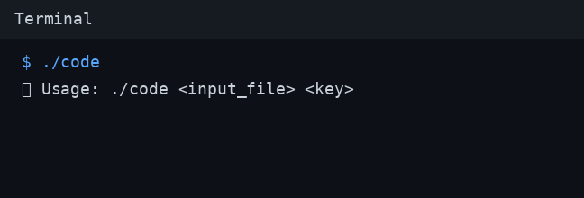
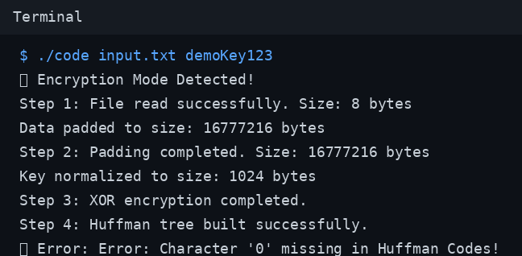

# 🔐 NeCrypt Engine

<p align="left">
  
  
  
</p>

NeCrypt Engine is a C++ command-line prototype for file encryption and decryption using a custom multi-stage pipeline: XOR transformation, Huffman encoding, and 3D permutation logic.

> ⚠️ **Security note:** This is an educational/research implementation and is not production-grade cryptography.

---

## 🏷️ Repository Name

Use this repository name for a professional GitHub identity:

- **`necrypt-engine-cpp`** ✅

If your current repo still has an old name, rename it in:
**GitHub → Settings → General → Repository name**

---

## 📚 Table of Contents

- [Project Overview](#project-overview)
- [Tech Stack](#tech-stack)
- [How It Works](#how-it-works)
- [Screenshots](#screenshots)
- [Features](#features)
- [Project Structure](#project-structure)
- [Requirements](#requirements)
- [Build](#build)
- [Usage](#usage)
- [Output & File Format](#output--file-format)
- [Current Limitations](#current-limitations)
- [Roadmap](#roadmap)
- [Contributing](#contributing)
- [License](#license)

---

## Project Overview ✨

The executable auto-detects mode from the file extension:

- **Encrypt mode** for regular files
- **Decrypt mode** for `.khn` files

Core stages:

1. Key normalization (1024 bytes)
2. XOR byte transformation
3. Huffman tree + bitstream encoding
4. 256 × 256 × 256 cube mapping
5. Multi-axis cube shifts
6. Prime-based shuffling (and reverse for decryption)

---

## Tech Stack 🧰

### Language & Compiler
- **C++17**
- **g++**

### Standard Library Usage
- Containers: `vector`, `unordered_map`, `string`, `queue`
- File processing: `fstream`, iterators
- Utilities: `bitset`, `algorithm`, `chrono`, `functional`, `stdexcept`

### Algorithm Components
- XOR transform
- Huffman compression/decompression
- 3D cube permutation
- Prime index deterministic shuffle

---

## How It Works ⚙️

### ✅ Encryption Flow
1. Read input bytes
2. Pad to internal working size
3. Normalize key
4. Apply XOR transform
5. Huffman encode data
6. Map into 3D cube
7. Apply cube shifts/permutations
8. Apply prime-based shuffle
9. Write encrypted output + metadata

### 🔄 Decryption Flow
1. Read encrypted metadata + payload
2. Normalize key
3. Reverse prime-based shuffle
4. Reverse cube transformations
5. Huffman decode
6. Reverse XOR transform
7. Remove padding
8. Write decrypted file

---

## Screenshots 🖼️

### Usage Example


### Encryption Run


---

## Features ✅

- Binary-safe input/output handling
- Single executable for encrypt + decrypt
- Extension-based mode detection (`.khn`)
- Automatic output naming:
  - Encryption: `<input>.khn`
  - Decryption: `decrypted_output.<original_extension>`
- Input validation and size guardrails
- Command-line status and error messages

---

## Project Structure 📁

```text
.
├── README.md
├── code.cpp
├── code
├── assets/
│   └── screenshots/
│       ├── usage.png
│       └── encryption-run.png
├── input.txt
├── input.txt.khn
└── output.bin
```

---

## Requirements 🧪

- Linux/macOS (or WSL on Windows)
- C++17-compatible compiler

---

## Build 🔨

```bash
g++ -std=c++17 -O2 code.cpp -o code
```

---

## Usage 🚀

```bash
./code <input_file> <key>
```

### Encrypt

```bash
./code input.txt my-secret-key
```

Output:
```text
input.txt.khn
```

### Decrypt

```bash
./code input.txt.khn my-secret-key
```

Output:
```text
decrypted_output.<ext>
```

---

## Output & File Format 📦

Encrypted files include metadata headers required for successful reverse processing.  
Changing serialization logic may break compatibility with older `.khn` files.

---

## Current Limitations ⚠️

- Single large source file (`code.cpp`)
- Limited modular separation
- Limited test coverage
- Not cryptographically audited

---

## Roadmap 🛣️

- Refactor into modules (`io`, `crypto`, `huffman`, `permutation`, `cli`)
- Add deterministic round-trip tests
- Introduce `.khn` format versioning
- Improve performance and memory checks

---

## Contributing 🤝

Contributions are welcome for:

- modular refactoring
- test improvements
- performance tuning
- documentation upgrades

Please keep pull requests focused and include clear verification notes.

---

## License 📄

No license file is currently included.  
To open-source publicly, add a license such as MIT or Apache-2.0.
